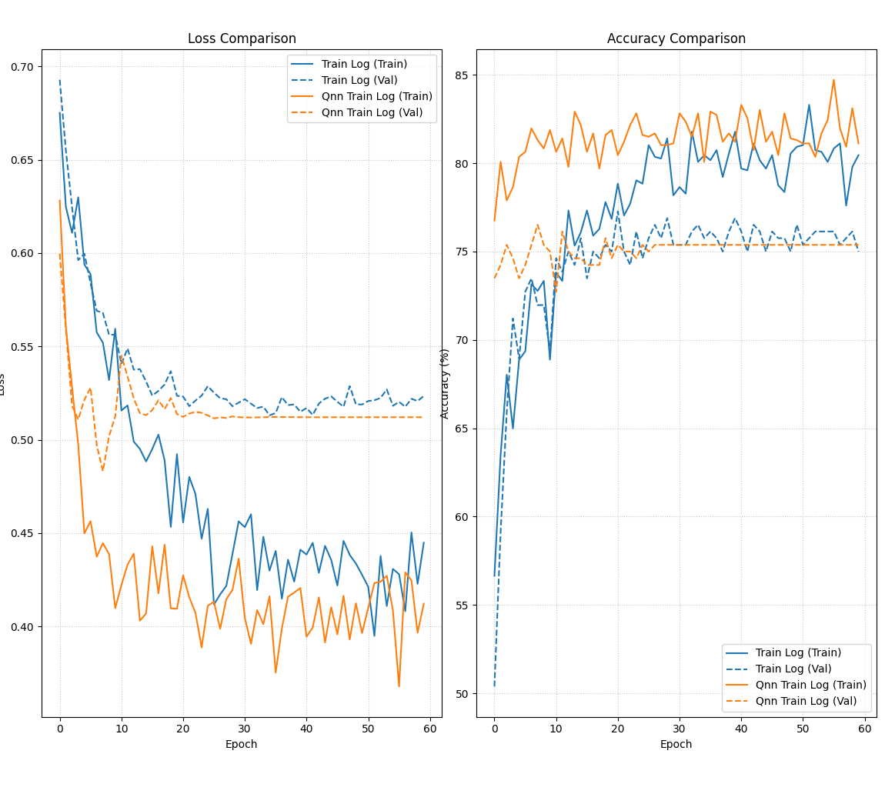

# Hybrid Classical-Quantum Neural Network for Breast Cancer Classification

This repository contains a full pipeline to reproduce, test, and critique the methodology proposed in the IEEE paper: *"A Novel Hybrid CNN-Quantum Neural Network Framework with Quantum Acceleration and Error Correction for High-Precision Breast Cancer Classification on AI Edge Devices."*

While the repository successfully implements the mathematical architecture described by the authors using **PyTorch** and **PennyLane**, our replication study uncovered severe inconsistencies and impossible claims in the original publication.

## 📊 Dataset Used

The original paper vaguely references "Open-source RSNA databases." To make this reproduction scientifically rigorous, this repository uses the **CBIS-DDSM (Curated Breast Imaging Subset of DDSM)** dataset (specifically the Mass Training Set).

* **Classes:** Benign (1) vs. Malignant (0).
* **Format:** DICOM images converted to cropped JPEGs representing specific Regions of Interest (ROIs).

## 🗂️ Repository Structure & Scripts

The pipeline is designed to be run sequentially.

### 1. `db_preprocess.py` (Data Pipeline)

* **What it does:** Reads the raw CBIS-DDSM CSV descriptions. Filters out unnecessary columns, handles class mapping (`BENIGN`/`BENIGN_WITHOUT_CALLBACK` -> 1, `MALIGNANT` -> 0), and validates that every physical JPEG file exists on disk.
* **Output:** Generates `clean_data_set_full.csv` (and a 20-image `clean_data_set.csv` for fast local testing).

### 2. `data_verify.py` (Sanity Check)

* **What it does:** A visualization tool that loads the cleaned dataset and plots the cropped breast cancer images in a 6x6 grid alongside their target labels.
* **Purpose:** Ensures the data transformations and file-path mappings from the preprocessing step are perfectly aligned before training begins.

### 3. `resnet152.py` (Classical Baseline & Feature Extractor)

* **What it does:** Implements standard Transfer Learning. It loads a pre-trained **ResNet152** model, swaps the final classifier head for binary classification, and trains it on the breast cancer dataset.
* **Output:** Saves the training logs and the best model weights (`classical_resnet_weights_best.pth`).

### 4. `qnn.py` (The Hybrid Quantum Model)

* **What it does:** Implements the Quantum Transfer Learning stage. It loads the frozen, pre-trained ResNet152 backbone, strips the final linear layer, and pipes the 2048-dimensional feature vector into a **Dressed Quantum Neural Network (QNN)**.
* **The Architecture:** Uses PennyLane to simulate an 8-qubit parameterized quantum circuit with Hadamard state preparation, $R_y$ angle encoding, and 6 layers of CNOT ring-entanglement + trainable $R_y$ rotations.
* **Output:** Saves the quantum head weights (`hybrid_qnn_weights_final.pth`) and training logs.

### 5. `perf_comparision.py` (Evaluation)

* **What it does:** Parses the CSV logs from both the classical and hybrid training runs and uses `matplotlib` to plot side-by-side comparisons of the Training/Validation Loss and Accuracy curves.

---

## 📈 Empirical Results (Classical vs. Quantum)



The original paper claimed their Hybrid QNN achieved a staggering **97% accuracy**. Our rigorous reproduction using standard datasets tells a very different story.

Below are the actual peak validation metrics extracted from our training logs (`train_log.csv` and `qnn_train_log.csv`):

| Model Architecture | Starting Val Accuracy | Peak Val Accuracy |
| :--- | :--- | :--- |
| **Classical ResNet152** | 50.37% | **76.51%** |
| **Hybrid QNN** | 73.48% | **75.38%** |

### Key Observations

1. **No "Quantum Advantage" Observed:** The Hybrid QNN failed to surpass the classical baseline. In fact, squeezing the highly expressive 2048-dimensional ResNet vector down into an 8-qubit circuit caused an information bottleneck, resulting in a slightly lower peak accuracy (**75.38%** vs **76.51%**).
2. **Instant Plateau:** Because the QNN is built on top of the frozen classical ResNet (which already learned the image features), the QNN starts with a high accuracy (**73.48%** at Epoch 0). However, it plateaus almost immediately, proving the quantum layers added no novel representational power to this specific task.
3. **The 97% Claim is Unfounded:** Our results strongly suggest that the 97% accuracy claimed in the original paper is unachievable with this architecture on a properly balanced, rigorous medical dataset.

---

## ⚠️ Scientific Issues Found in the Original Paper

A major contribution of this repository is the critical evaluation of the source paper. During replication, we discovered multiple red flags indicating a lack of scientific rigor in the original publication:

### 1. Contradictory Architecture

* **The Text:** Section III.D.4 explicitly states the quantum circuit utilizes an **8-qubit** architecture using **CNOT** gates for entanglement.
* **The Diagram:** The paper's official schematic (Figure 4) displays a **4-qubit** architecture using **CZ (Controlled-Z)** gates.
* **Our Fix:** We strictly followed the mathematical text (8 qubits, CNOT ring topology) in `qnn.py`, as the diagram was functionally incompatible with their own claims.

### 2. Impossible "Quantum Error Correction" Claims

* The authors claim their 97% accuracy is partly due to implementing **Shor’s Code** and **Surface Codes** on an "AI Edge Device" (NVIDIA Jetson TX2).
* **The Reality:** Shor’s code requires 9 physical qubits to encode just 1 logical qubit. Running this on an 8-qubit logical network would require a minimum of **72 physical qubits**. Simulating 72 fully error-corrected qubits is computationally impossible on modern classical supercomputers, let alone a low-power edge device. This suggests the error-correction claims are theoretical "buzzwords" rather than implemented code.

### 3. Lack of Empirical Transparency

* The paper provides no graphical proofs of training—no loss curves or accuracy trajectories across epochs. The only "proof" is a static table and a generic screenshot of an NVIDIA system monitor, making peer-review and exact reproduction impossible without educated reverse-engineering.

---

## 🚀 How to Run

1. Clone the repository and install dependencies:

   ```bash
   pip install torch torchvision pandas pennylane matplotlib scikit-learn
   ```

2. Place your raw image data in `./archive/jpeg/` and the CSV in `./archive/csv/`.
3. Run the pipeline in order:

   ```bash
   python db_preprocess.py
   python data_verify.py
   python resnet152.py
   python qnn.py
   python perf_comparision.py
   ```

   *(Note: You can answer `y` to the prompt in the scripts to run a fast 20-image test mode before committing to the full dataset).*
