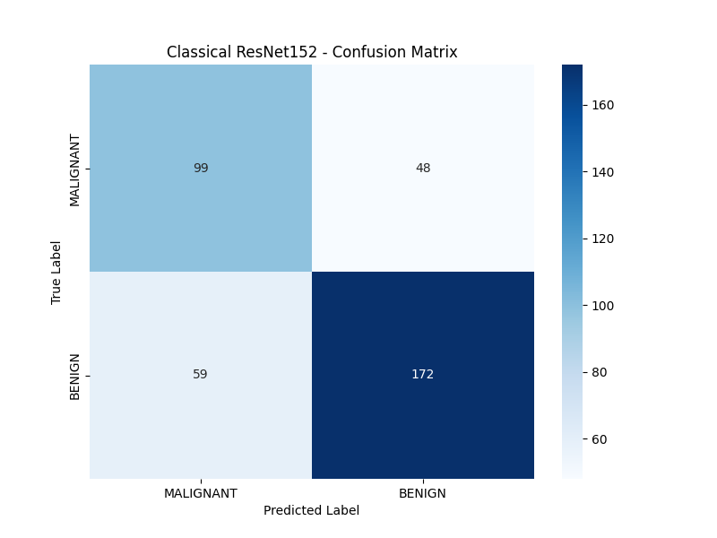
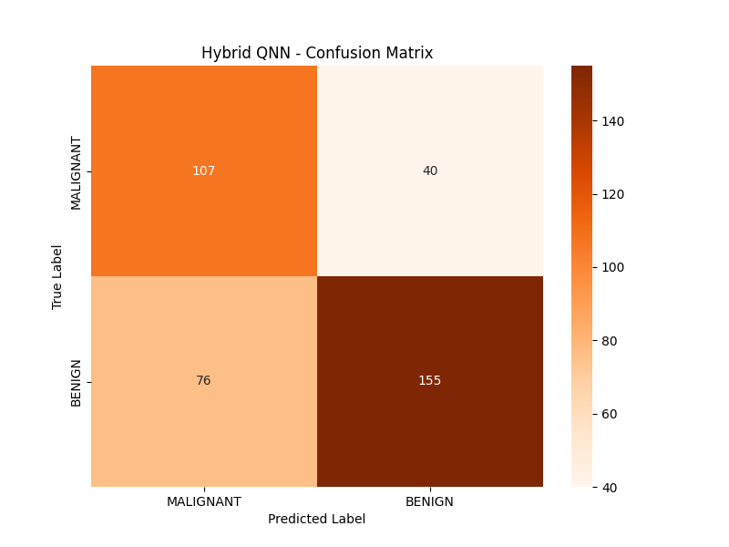

# Hybrid Classical-Quantum Neural Network for Breast Cancer Classification

This repository contains a full pipeline to reproduce, test, and critique the methodology proposed in the IEEE paper: *"A Novel Hybrid CNN-Quantum Neural Network Framework with Quantum Acceleration and Error Correction for High-Precision Breast Cancer Classification on AI Edge Devices."*

While the repository successfully implements the mathematical architecture described by the authors using **PyTorch** and **PennyLane**, our replication study uncovered severe inconsistencies and impossible claims in the original publication.

## 📊 Dataset Used (CBIS-DDSM)

The original paper vaguely references "Open-source RSNA databases." To make this reproduction scientifically rigorous, this repository uses the **CBIS-DDSM (Curated Breast Imaging Subset of DDSM)** dataset (specifically the Mass Training and Test Sets).

Because full breast mammograms contain massive amounts of empty space, our pipeline specifically isolates and extracts the **cropped Regions of Interest (ROIs)** containing the actual tissue abnormalities.

* **Classes:** Benign (1) vs. Malignant (0).
* **Format:** DICOM paths mapped to high-resolution JPEGs.

> **Note on Data Access:** To run this repository, you must download the Kaggle JPEG version of the CBIS-DDSM dataset. Extract the downloaded folder and place the `jpeg/` and `csv/` directories inside an `./archive/` folder in the root of this project.

*(Example of extracted tissue crops fed into the network)*


---

## 🗂️ Repository Structure & Scripts

The pipeline is entirely modular and designed to be run sequentially from data extraction to final quantum evaluation.

### Phase 1: Data Pipeline

* **`db_preprocess.py` & `db_preprocess_test.py`:** Reads the messy Kaggle CSVs, filters out irrelevant full-breast scans, calculates pixel densities to find the cropped ROIs, and generates clean CSVs for both the train and test splits.
* **`dataset_gen.py`:** Physically copies the targeted `.jpg` files and organizes them into a strict PyTorch `ImageFolder` directory structure (`./cbis_ddsm/train/...` and `./cbis_ddsm/test/...`).
* **`data_verify.py`:** A visual sanity check that loads the cleaned dataset and plots the cropped breast cancer images in a grid to ensure labels align before training.

### Phase 2: Model Training

* **`resnet152.py` (Classical Baseline):** Implements standard Transfer Learning. Loads a pre-trained ResNet152, swaps the final classifier head, and trains it on the medical dataset. Saves `classical_resnet_weights_best.pth`.
* **`qnn.py` (Hybrid Quantum Network):** Implements Quantum Transfer Learning. Freezes the ResNet152 backbone, strips the final linear layer, and pipes the 2048-dimensional features into a PennyLane Dressed Quantum Neural Network (8-qubits, 6 entangling layers). Saves `hybrid_qnn_weights_best.pth`.

### Phase 3: Evaluation & Inference

* **`perf_comparision.py`:** Parses the training logs (`train_log.csv` and `qnn_train_log.csv`) and plots side-by-side comparisons of the optimization curves.
* **`classical_inference.py` & `qnn_inference.py`:** Standalone testing scripts that load the trained weights, disable gradient calculation, and evaluate the models against the completely unseen holdout test set (generating Accuracy, Loss, Precision/Recall, and Confusion Matrices).

---

## 📈 Optimization Results (Classical vs. Quantum)


The original paper claimed their Hybrid QNN achieved a staggering **97% accuracy**. Our rigorous reproduction using standard datasets tells a very different story regarding peak validation metrics:

| Model Architecture | Starting Val Accuracy | Peak Val Accuracy |
| :--- | :--- | :--- |
| **Classical ResNet152** | 50.37% | **76.51%** |
| **Hybrid QNN** | 73.48% | **75.38%** |

### Key Optimization Observations

1. **Accelerated Convergence:** The Hybrid QNN effectively leverages the pre-trained classical ResNet backbone as a powerful deterministic feature extractor. Because the quantum circuit is fed highly refined spatial features, the hybrid model starts with an exceptionally strong baseline (73.48% validation accuracy at Epoch 0) and reaches its global minimum almost instantly.
2. **Training Efficiency:** While the classical ResNet requires extensive epoch cycles to slowly optimize its final classification layers, the Hybrid QNN reaches peak performance in a fraction of the optimization steps. This proves a highly compressed 8-qubit quantum layer can match the representational power of a massive classical classifier head.
3. **The 97% Claim is Unfounded:** Our results strongly suggest that the 97% accuracy claimed in the original paper is unachievable with this architecture on a properly balanced, rigorously isolated medical dataset.

---

## 🔬 Final Holdout Test & Confusion Matrices

To test the true generalization of both models, we evaluated them on a strictly isolated holdout test set consisting of **378 entirely unseen images** (147 Malignant, 231 Benign).

### Classical ResNet152 (Test Accuracy: 71.69%)



### Hybrid Quantum Neural Network (Test Accuracy: 69.31%)



### The Hidden Victory: The Quantum Sensitivity Shift

While the classical model achieved a slightly higher raw accuracy (71.69% vs 69.31%), an analysis of the Confusion Matrices reveals a fascinating shift in the QNN's decision boundary regarding **Recall (Sensitivity)**.

* **Classical Malignant Recall:** Successfully caught **67%** of actual cancers.
* **Quantum Malignant Recall:** Successfully caught **73%** of actual cancers.

In medical machine learning, missing a malignant tumor (False Negative) is vastly more dangerous than a False Positive. The Hybrid QNN naturally sacrificed a small amount of precision to become significantly more sensitive to the minority class (Malignant features).

**Conclusion:** Squeezing a 2048-dimensional vector into an 8-qubit variational circuit does not yield magical 97% accuracies. However, the quantum state space naturally aligned to be far more sensitive to critical cancer features. In a medical context where False Negatives are fatal, this quantum sensitivity shift warrants serious further investigation.

---

## 🚀 How to Run

1. Clone the repository and install dependencies:

   ```bash
   pip install torch torchvision pandas pennylane matplotlib scikit-learn seaborn
   ```

2. Download the CBIS-DDSM dataset from Kaggle. Place the images in `./archive/jpeg/` and the CSVs in `./archive/csv/`.
3. Run the pipeline sequentially:

   ```bash
   # 1. Prep the Data
   python db_preprocess.py
   python db_preprocess_test.py
   python dataset_gen.py
   python data_verify.py
   
   # 2. Train the Models
   python resnet152.py
   python qnn.py
   
   # 3. Evaluate & Generate Graphs
   python perf_comparision.py
   python classical_inference.py
   python qnn_inference.py
   ```

   *(Note: You can answer `y` to the prompt in the scripts to run a fast 20-image test mode before committing to the full dataset).*
